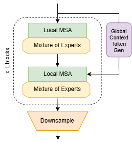

<div align="center">


# Global Context Vision Mixture of Experts (GCViMoE)
[](https://opensource.org/licenses/MIT) [](https://www.python.org/downloads/release/python-380/) []()

This repository presents the PyTorch implementation of **Global Context Vision Mixture of Experts** (GCViMoE), a project conducted under the scope of Computer Vision course - COMP3040 final project. 
</div>

The main block in the architecture of GCViMoE is demonstrated in the following:




## Introduction

We propose Global Context Vision Mixture of Experts (GC-ViMoE), which integrates the Mixture of Experts paradigm with the Global Context Vision Transformer. By replacing traditional multilayer perceptron blocks with dynamically routed expert blocks, our architecture maintains the rich contextual features and locality-aware properties of GCViT while substantially reducing computational overhead. GCViMoE is expected to achieve efficiency through selective expert activation based on input characteristics, demonstrating comparable or superior performance to state-of-the-art models with significantly lower computational requirements.


## Installation

The dependencies can be installed by running:

```bash
pip install -r requirements.txt
```

## Data Preparation

Please download the ImageNet dataset from its official website. The training and validation images need to have
sub-folders for each class with the following structure:

```bash
  imagenet
  ├── train
  │   ├── class1
  │   │   ├── img1.jpeg
  │   │   ├── img2.jpeg
  │   │   └── ...
  │   ├── class2
  │   │   ├── img3.jpeg
  │   │   └── ...
  │   └── ...
  └── val
      ├── class1
      │   ├── img4.jpeg
      │   ├── img5.jpeg
      │   └── ...
      ├── class2
      │   ├── img6.jpeg
      │   └── ...
      └── ...
 
  ```

## Commands

### Training on ImageNet-tiny From Scratch (Multi-GPU)

The `GCViMoE` model can be trained on ImageNet-tiny dataset by running:

```bash
sh train_moe.sh
```

## Citation

GCViT paper
```
@inproceedings{hatamizadeh2023global,
  title={Global context vision transformers},
  author={Hatamizadeh, Ali and Yin, Hongxu and Heinrich, Greg and Kautz, Jan and Molchanov, Pavlo},
  booktitle={International Conference on Machine Learning},
  pages={12633--12646},
  year={2023},
  organization={PMLR}
}
```

Swin-MoE
```
@misc{hwang2022tutel,
      title={Tutel: Adaptive Mixture-of-Experts at Scale}, 
      author={Changho Hwang and Wei Cui and Yifan Xiong and Ziyue Yang and Ze Liu and Han Hu and Zilong Wang and Rafael Salas and Jithin Jose and Prabhat Ram and Joe Chau and Peng Cheng and Fan Yang and Mao Yang and Yongqiang Xiong},
      year={2022},
      eprint={2206.03382},
      archivePrefix={arXiv}
}
```


## Licenses

Copyright © 2023, NVIDIA Corporation. All rights reserved.

This work is made available under the Nvidia Source Code License-NC. Click [here](LICENSE) to view a copy of this license.

The pre-trained models are shared under [CC-BY-NC-SA-4.0](https://creativecommons.org/licenses/by-nc-sa/4.0/). If you remix, transform, or build upon the material, you must distribute your contributions under the same license as the original.

For license information regarding the timm, please refer to its [repository](https://github.com/rwightman/pytorch-image-models).

For license information regarding the ImageNet dataset, please refer to the ImageNet [official website](https://www.image-net.org/). 

